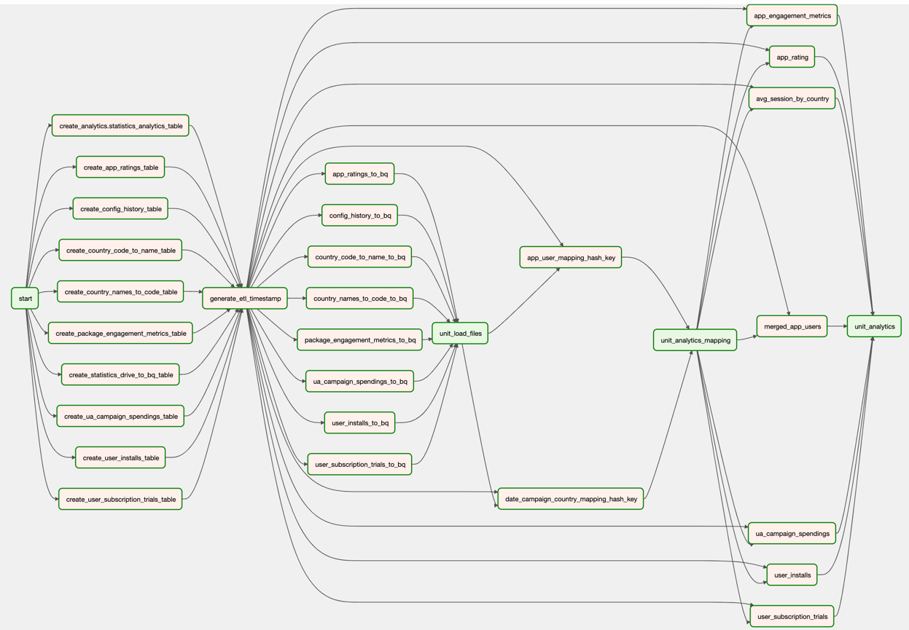
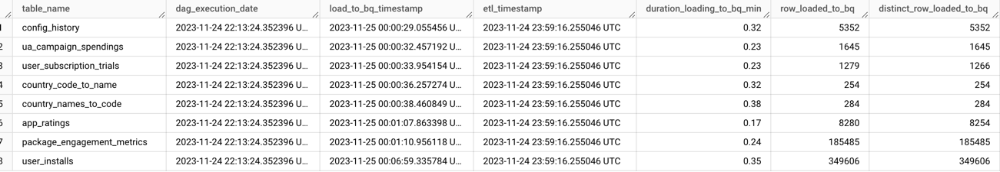
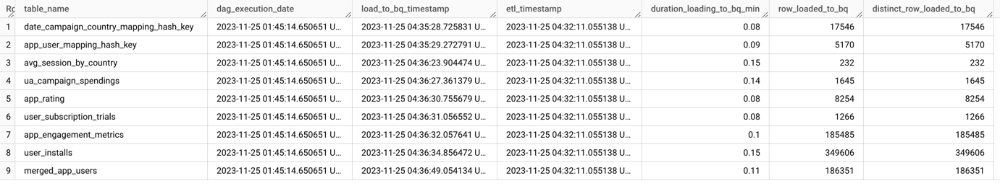

# Data Pipeline DAG Documentation

**Note**: This project involves GCP, and as my expertise primarily lies in AWS, my interaction with Google Cloud services may not always be precise. 

### The project structure:
1. __dags__: Data Pipelines with DAGs and SQL. Also, it includes package __modules__ with all useful scripts.
2. __data__: Input Data. But in DAG I use loading directly from shared [folder](https://drive.google.com/drive/folders/1IxN2e2sUVXqBh7exAkFTO7AwSuBGCc6E) with input data
3. __terraform__: Scripts for Deploy Services. _Made for Google Composer only. Can be extended._
4. __README.md__: Description of project.
5. __requirements.txt__: external Python packages. For local using.

Google Cloud **project** is [here](https://console.cloud.google.com/bigquery?referrer=search&project=datatobq-405917&ws=!1m0). 
I use free trial for communicate with GCP Services. Access shared with `artem.p@rounds.com` user.

___
**Note**:

_I use Google Composer (Full information bellow), but for saving cost the environment is deleted._

_I am not sure that you will have enough permission for deploy and run Environment in this project._

_If needed we can make brief call for deploying Google Composer and running provided Airflow DAG._
___

## Overview
This document details the Airflow DAG `create_and_load_tables` data pipeline.
Designed for loading and processing data from Google Drive to Google BigQuery. 
It is a critical part of the ETL process, handling various datasets and generating analytical data in BigQuery.

In Google Cloud Platform (GCP), there are several services to create and manage data pipelines that can run Python and SQL scripts. 
The choice of service depends on your specific data processing and orchestration needs.

### Services Overview:
During research, I paid attention on the following Services:
#### Cloud Dataflow:
- **Description**: A fully-managed service for stream and batch data processing.
- **Use Cases**: Suitable for complex, large-scale data processing tasks.
- **Languages**: Supports Python through Apache Beam. SQL can be used via Beam SQL.
- **Link**: [Cloud Dataflow](https://cloud.google.com/dataflow)

#### Cloud Composer:
- **Description**: Managed Apache Airflow service for workflow orchestration.
- **Use Cases**: Ideal for orchestrating complex workflows.
- **Languages**: Native Python support. SQL tasks can be managed using Airflow operators.
- **Link**: [Cloud Composer](https://cloud.google.com/composer)

#### BigQuery:
- **Description**: Data warehouse service with capabilities for running SQL queries.
- **Use Cases**: Best for data analysis and reporting with SQL. Python scripts can interact with BigQuery.
- **Languages**: SQL for queries. Python for external script interaction.
- **Link**: [BigQuery](https://cloud.google.com/bigquery)

#### Cloud Functions and Cloud Run:
- **Description**: Serverless platforms for deploying small, single-purpose functions.
- **Use Cases**: Suitable for lightweight, event-driven processes.
- **Languages**: Python supported. SQL through connections to Cloud SQL or BigQuery.
- **Link**: [Cloud Functions](https://cloud.google.com/functions), [Cloud Run](https://cloud.google.com/run)

#### Dataproc:
- **Description**: Managed Hadoop and Spark service.
- **Use Cases**: Good for data processing workflows fitting the Hadoop/Spark model.
- **Languages**: PySpark for Python. Spark SQL for SQL scripts.
- **Link**: [Dataproc](https://cloud.google.com/dataproc)

### Choosing the Right Service:

Based on workflow's complexity and processing requirements
**Google Composer Airflow** was chosen as the orchestration tool for this pipeline due to several key benefits:

1. **Managed Service:** Google Composer is a fully managed service that simplifies the setup and maintenance of Airflow environments. It eliminates the need for manual configuration and scaling of the orchestration infrastructure.

2. **Integration with GCP Services:** As a part of the Google Cloud Platform, Composer has seamless integrations with other GCP services like BigQuery, Google Drive, and Secret Manager. This integration streamlines data workflows and enhances security through unified access management.

3. **Scalability:** Composer easily scales to handle an increase in workflow complexity and data volume. This scalability is essential for growing data pipelines and evolving business requirements.

4. **Reliability and Security:** Being a Google Cloud service, Composer inherits strong security protocols and reliable infrastructure, ensuring data safety and high availability.

5. **Simplified Workflow Management:** Composer's Airflow environment simplifies the process of creating, scheduling, and monitoring workflows. This allows for more focus on data pipeline development rather than infrastructure management.

6. **Customization and Flexibility:** Composer supports custom plugins and configurations, offering the flexibility to tailor the environment to specific pipeline needs.

7. **Community and Support:** Airflow has a strong community, ensuring continuous updates and support. Google's support and seamless updates to Composer further enhance this benefit.

By leveraging Google Composer Airflow, the pipeline gains a robust, secure, and scalable orchestration environment that aligns well with the data processing objectives and the broader architecture on the GCP platform.

---

# Data Pipeline
## Graph:

**dag_csv_bq.py** - Python script with DAG implementation. [_git_](https://github.com/seniut/DataToBQ/blob/master/dags/dag_csv_bq.py)

The DAG is constructed using the `TaskFlow API` approach, where the task __generate_etl_timestamp__ is directly linked to each subsequent task utilizing __etl_timestamp__. 
While this results in a somewhat cluttered graph visualization, the underlying logic is consistent and functions as intended. 

## DAG Configuration
- **DAG ID:** `create_and_load_tables`
- **Owner:** `Airflow`
- **Start Date:** 1 day ago from the current date
- **Retries:** `1`
- **Retry Delay:** `1 minute`
- **Tags:** `['etl']`

## GCP Project Configuration
- **Project ID:** `datatobq-405917`
- **Secret ID for Service Account:** `csv-unloader-secret`
- **Google Drive Folder ID:** `1-4ElvxoHdIOl3uMjPILdme-YqXpO92Ep` - this is id of shared [folder](https://drive.google.com/drive/folders/1IxN2e2sUVXqBh7exAkFTO7AwSuBGCc6E) with input data.

## Task Descriptions
1. **generate_etl_timestamp:** Generates the current UTC timestamp as an ETL timestamp for data tracking. Using in each Task and in Statistics gathering mechanism. Needed for serving merging in statistics data and creating metadata reports.
   
2. **create_table_task_factory:** Factory function to create tasks for each table defined in schemas. These tasks handle the creation of BigQuery tables, including dropping existing tables if necessary (except for statistics tables).

3. **drive_to_bq_task_factory:** Factory function to create tasks for loading CSV data from Google Drive to BigQuery. It includes data processing logic, such as file downloading, loading into BigQuery, updating the ETL timestamp and Statistics gathering for creating quality checks and reports. This is __data__ dataset.

4. **analytics_mapping_task_factory:** Factory function to create tasks for running SQL queries for analytics mapping. Processes data in BigQuery to generate mapping tables and collects statistics about the operation. It Includes Statistics gathering for creating quality checks and reports. This is __analytics__ dataset level.

5. **analytics_task_factory:** Similar to the analytics mapping tasks, but focused on creating and loading data into various analytics tables. It Includes Statistics gathering for creating quality checks and reports. This is __analytics__ dataset level.

__Statistics (Metadata)__ (structure description bellow) gathering for creating quality checks and reports based on:
**useful.build_statistics** common function.
**Note**: Can be extended and refactored for more flexible using.

## Task Dependencies and Flow
- The DAG starts with the `start` task (an EmptyOperator).
- Then moves to the `generate_etl_timestamp` task.
- Subsequent dynamic tasks are created using `create_table_task_factory` for each table schema defined. These tasks depend on `generate_etl_timestamp`.
- The `drive_to_bq_task_factory` creates tasks for loading data from Google Drive to BigQuery. These tasks depend on the completion of table creation tasks.
- The loaded data from Drive triggers execution of analytics mapping tasks created by `analytics_mapping_task_factory`.
- Finally, `analytics_task_factory` generates tasks for further processing and loading of analytics data, dependent on the completion of the mapping tasks.

## Execution Logic
- The DAG triggers based on its schedule or can be manually triggered. For now, made for manual run only. Schedule time can be updated.
- Initially generates an ETL timestamp used throughout the DAG for data consistency.
- Proceeds to create or replace necessary tables in BigQuery.
- Data from Google Drive is loaded into these tables, where transformation and processing occur.
- Subsequent tasks perform analytics mapping and generate analytical data for business intelligence and analytics processes.

## Additional Notes
- Uses a service account (with needed permission) configured in GCP Secret Manager for secure authentication.
- Designed to handle retries and failures, ensuring data integrity and consistency.
- Modular task factory design allows scalability and maintainability.

---

# BiqQuery Structure

**_Currently, the solution operates on a full sync basis, which means it entirely truncates and reloads data rather than supporting delta loading or incremental data ingestion. 
However, this approach can be expanded to include such functionalities in the future._**

The Solution includes following tables and datasets:
### 1. Dataset 'Data' Tables:
- **app_ratings**: Contents data from app_ratings.csv file.
- **config_history**: Contents data from config_history.csv file.
- **country_code_to_name**: Contents data from country_code_to_name.csv file.
- **country_names_to_code**: Contents data from country_names_to_code.csv file.
- **package_engagement_metrics**: Contents data from package_engagement_metrics.csv file.
- **ua_campaign_spendings**: Contents data from ua_campaign_spendings.csv file.
- **user_installs**: Contents data from user_installs.csv file.
- **user_subscription_trials**: Contents data from user_subscription_trials.csv file.
- **statistics_drive_to_bq**: Contents Metadata information of tables during loading to __data__ dataset. Detailed description of structure is in description of **statistics_analytics** tabl.
Example bellow:

### 2. Dataset 'Analytics' Tables:

1. **app_user_mapping_hash_key**: _[git](https://github.com/seniut/DataToBQ/blob/master/dags/modules/sql/app_user_mapping_hash_key.sql)_

After careful analysis has been figure out that for merging all existing sources (app and user sources) can be used the following fields:
- `package`
- `date` (DATE type, not TIMESTAMP)
- `version`

All these fields have been met in each source and demonstrated excellent data consistency.

Columns:
- `hash_key`: Unique hash key for mapping (Primary key).
- `package`: App package name.
- `date`: The date of app engagement.
- `version`: App version.
- `etl_timestamp`: The timestamp when ETL process was executed.

2. **date_campaign_country_mapping_hash_key**: _[git](https://github.com/seniut/DataToBQ/blob/master/dags/modules/sql/date_campaign_country_mapping_hash_key.sql)_

This mapping help to normalize _user_installs_ table and as result final merged app and user data (_merged_app_users_ table)

Columns:
- `hash_key`: Unique hash key for the mapping (Primary key).
- `date`: Date of the campaign.
- `campaign`: Campaign name.
- `country`: Country name.
- `etl_timestamp`: The timestamp when ETL process was executed.

**app_user_mapping_hash_key** and **date_campaign_country_mapping_hash_key** tables using as mapping/dictionary tables for normalizing __dataset 'Analytics'__.

3.**app_engagement_metrics**: _[git](https://github.com/seniut/DataToBQ/blob/master/dags/modules/sql/app_engagement_metrics.sql)_

Columns:
- `hash_key`: hash key identification (FK) of `app_user_mapping_hash_key` table.
- `country_code`: The country code of the app usage.
- `sessions`: Number of sessions for the app.
- `avg_session_duration`: Average duration of app sessions.
- `dau`: Daily Active Users.
- `wau`: Weekly Active Users.
- `mau`: Monthly Active Users.
- `etl_timestamp`: The timestamp when ETL process was executed.

4. **app_rating**: _[git](https://github.com/seniut/DataToBQ/blob/master/dags/modules/sql/app_rating.sql)_

Columns:
- `hash_key`: hash key identification (FK) of `app_user_mapping_hash_key` table.
- `date`: The date of the rating.
- `app_version_code`: The version code of the app.
- `star_rating`: Star rating given to the app.
- `etl_timestamp`: The timestamp when ETL process was executed.

5. **user_installs**: _[git](https://github.com/seniut/DataToBQ/blob/master/dags/modules/sql/user_installs.sql)_

Columns:
- `hash_key`: hash key identification (FK) of `app_user_mapping_hash_key` table.
- `user_id`: Unique identifier for the user.
- `mobile_brand_name`, `mobile_marketing_name`: Mobile brand and marketing names.
- `hash_date_campaign_country`: Hash key for date, campaign, and country mapping. Hash key identification (FK) of `date_campaign_country_mapping_hash_key` table
- `source`: Source of the installation.
- `etl_timestamp`: The timestamp when ETL process was executed.

6. **user_subscription_trials**: _[git](https://github.com/seniut/DataToBQ/blob/master/dags/modules/sql/user_subscription_trials.sql)_

Columns:
- `hash_key`: hash key identification (FK) of `app_user_mapping_hash_key` table.
- `user_id`: Unique identifier for the user.
- `sku`: Stock Keeping Unit.
- `order_id`: Order identifier.
- `install_timestamp`, `purchase_timestamp`: Installation and purchase timestamps.
- `etl_timestamp`: The timestamp when ETL process was executed.

7. **ua_campaign_spendings**: _[git](https://github.com/seniut/DataToBQ/blob/master/dags/modules/sql/ua_campaign_spendings.sql)_

Columns:
- `hash_key`: Hash key for the campaign. Hash key identification (FK) of `date_campaign_country_mapping_hash_key` table.
- `cost_ils`: Cost in Israeli Shekels.
- `etl_timestamp`: The timestamp when ETL process was executed.
- 

8. **merged_app_users**: _[git](https://github.com/seniut/DataToBQ/blob/master/dags/modules/sql/merged_app_users.sql)_

Columns:
- `hash_key`: Hash key for user-app mapping. Hash key identification (FK) of `app_user_mapping_hash_key` table.
- `user_id`: Unique identifier for the user.
- `hash_date_campaign_country`: Hash key for date, campaign, and country mapping. Hash key identification (FK) of `date_campaign_country_mapping_hash_key` table.
- `order_id`: Order identifier.
- `star_rating`: App star rating.
- `country_code`: Country code.
- `sessions`: Number of sessions.
- `avg_session_duration`: Average session duration.
- `dau`, `wau`, `mau`: User activity metrics.
- `etl_timestamp`: The timestamp when ETL process was executed.

9. **avg_session_by_country**: _[git](https://github.com/seniut/DataToBQ/blob/master/dags/modules/sql/avg_session_by_country.sql)_

Columns:
- `country`: Country name.
- `avg_session_duration_by_country`: Average session duration in the country.
- `avg_session_by_country`: Average number of sessions in the country.
- `avg_dau_by_country`: Average Daily Active Users in the country.
- `avg_wau_by_country`: Average Weekly Active Users in the country.
- `avg_mau_by_country`: Average Monthly Active Users in the country.
- `etl_timestamp`: The timestamp when ETL process was executed.

10. **statistics_analytics** table: Contents Metadata information of tables in __analytics__. _[git](https://github.com/seniut/DataToBQ/blob/528f276ac21f7de78faa9d43d3eca7a625ad0e93/dags/modules/useful.py#L33)_

The statistics tables (_data.statistics_drive_to_bq_ and _analytics.statistics_analytics_) in BigQuery is designed to store various metrics related to data loading processes. 
Below is a detailed description of each column in the statistics table.

Columns:

1.`table_name`:
- **Description**: The name of the table to which the statistics pertain.
- **Type**: String
- **Example**: 'user_installs'

2.`dag_execution_date`:
- **Description**: The date and time when the DAG (Directed Acyclic Graph) in Airflow was executed.
- **Type**: Timestamp
- **Example**: '2023-04-01T12:30:00Z'

3.`load_to_bq_timestamp`:
- **Description**: The timestamp indicating when the data loading to BigQuery was initiated.
- **Type**: Timestamp
- **Example**: '2023-04-01T12:35:00Z'

4.`etl_timestamp`:
- **Description**: The timestamp representing when the ETL process was executed.
- **Type**: Timestamp
- **Example**: '2023-04-01T12:40:00Z'

5.`duration_loading_to_bq_min`
- **Description**: The total duration, in minutes, taken to load the data into the BigQuery table, rounded to two decimal places.
- **Type**: Float
- **Example**: 0.25

6.`row_loaded_to_bq`
- **Description**: The total number of rows loaded into the BigQuery table.
- **Type**: Integer
- **Example**: 1000

7.`distinct_row_loaded_to_bq`
- **Description**: The count of distinct rows in the BigQuery table after the data load. It is determined by executing a query that counts distinct combinations of all columns in the table.
- **Type**: Integer
- **Example**: 950

These columns collectively provide a comprehensive overview of the data loading process, including timing, count of records, 
and data uniqueness, which is crucial for monitoring and auditing ETL operations.

Example bellow:

---

## Deploy:
_Tested on macOS: Deploying takes ~20min. Destroying takes ~6min_

[git](https://github.com/seniut/DataToBQ/tree/master/terraform)

_Was created Terraform resource for deploying Google Composer only. 
Can be extended for other resource (like service account)_

**Guideline:**
1. Open ./terraform dir in terminal
2. Make this script executable: `chmod +x automation.sh`
3. Need to have [installed](https://developer.hashicorp.com/terraform/tutorials/aws-get-started/install-cli) Terraform package
4. Need to have installed [gsutil](https://cloud.google.com/sdk/docs/install) (part og gcloud lib)
5. To deploy: `./automation.sh deploy`
6. To destroy: `./automation.sh destroy`
---

This README.md provides a comprehensive understanding of the DAG's purpose, configuration, and execution flow, 
ensuring maintainability and ease of use for future modifications and enhancements. Also, BQ tables structure and Deploying process.
